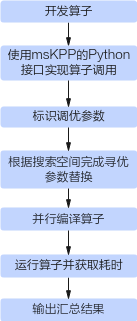

# MindStudio Kernel Launcher工具用户指南

## 简介

MindStudio Kernel Performance Prediction（算子调用工具，msKL）具有调用msOpGen算子工程和基于Ascend C模板库进行自动调优的功能，具体介绍如下：

- [调用msOpGen算子工程功能介绍](#调用msopgen算子工程功能介绍)：msKL工具提供的tiling_func和get_kernel_from_binary接口，可以直接调用msOpGen算子工程。
- [自动调优功能介绍](#自动调优功能介绍)：msKL提供模板库Kernel下发代码生成、编译、运行的能力，同时提供Kernel内代码替换并自动调优的能力。

## 使用前准备

**环境准备**

进行算子开发之前，需要安装驱动固件和CANN Toolkit软件包以及ops算子包，请参见《[CANN 软件安装指南](https://www.hiascend.com/cann/download)》。本节不再给出安装示例。完成相关环境变量的配置后，可直接使用Kernel轻量化调用的功能。

- 若要使用[自动调优](#自动调优功能介绍)功能，需要下载[链接](https://gitcode.com/cann/catlass)中的Ascend C模板库。
- 二次开发请保证输入数据可信安全。

**约束**

- 出于安全性及权限最小化角度考虑，本代码仓中的工具均不应使用root等高权限账户进行操作，建议使用普通用户权限安装执行。
- 使用算子开发工具前，请确保执行用户的umask值大于等于0027，否则会造成获取的性能数据所在目录和文件权限过大。
- 使用算子工具前，请保证使用最小权限原则（如：禁止other用户可写，禁止666或777）。
- 不建议配置或运行其他用户目录下的自定义脚本，避免提权风险。
- 下载代码样例时，需执行以下命令指定分支版本。

    ```shell
    git clone https://gitee.com/ascend/samples.git -b v1.9-8.3.RC1
    ```

## 调用msOpGen算子工程功能介绍

### 功能说明

当前部分算子开源仓采用了msOpGen提供的工程模板。然而，基于此模板进行算子调用较为复杂，且难以实现算子的轻量化调测。为了解决此类问题，我们可以利用msKL工具提供的tiling_func和get_kernel_from_binary接口，直接调用msOpGen工程中的tiling函数以及用户自定义的Kernel函数。

### 注意事项

- 使用本功能时，算子输入输出仅支持numpy.Tensor、torch.Tensor。
- 若CANN中曾经部署过相同类型的算子（op_type），用户修改了tiling函数并重新编译，则需要在CANN环境中重新部署该算子。
- 调用tiling_func和get_kernel_from_binary接口时，系统会在当前目录下的mindstudio_mskl_gen文件夹中生成以下中间文件，该文件仅供开发定位使用，用户无需关注。请勿修改该文件夹及其子文件的内容，以免造成工具功能异常。

    ```shell
    (p39) root@ubuntu:~/project/add_custom/CustomOp$ ll mindstudio_mskl_gen/
    total 388
    drwxr-x---  2 root root    314 Jul 24 09:40 ./
    drwxr-x--- 10 root root   4096 Jul 24 09:40 ../
    -rw-------  1 root root  13042 Jul 24 09:40 _mskl_gen_binary_launch.1.cpp
    -rw-------  1 root root  13231 Jul 24 09:40 _mskl_gen_binary_launch.2.cpp
    -rw-------  1 root root  26640 Jul 24 09:40 _mskl_gen_binary_module.1.so
    -rw-------  1 root root  26640 Jul 24 09:40 _mskl_gen_binary_module.2.so
    -rw-------  1 root root   4878 Jul 24 09:40 _mskl_gen_tiling.1.cpp
    -rw-------  1 root root 141432 Jul 24 09:40 _mskl_gen_tiling.1.so
    -rw-------  1 root root   5127 Jul 24 09:40 _mskl_gen_tiling.2.cpp
    -rw-------  1 root root 141432 Jul 24 09:40 _mskl_gen_tiling.2.so
    ```

### 使用示例

本章节以matmulleakyrelu算子工程为例，介绍如何利用msKL工具提供的tiling_func和get_kernel_from_binary接口调用msOpGen工程中的tiling函数以及用户自定义的Kernel函数，其他类型的算子操作均可参考此流程进行操作。

**环境准备**<a id="环境准备"></a>

- 请参考[使用前准备](#使用前准备)，完成相关环境变量的配置。
- 单击[链接](https://gitee.com/ascend/samples/tree/master/operator/ascendc/0_introduction/12_matmulleakyrelu_frameworklaunch)获取样例工程，为进行算子检测做准备。

    > [!NOTE] 说明
    > 
    >- 本样例工程以Atlas A2 训练系列产品/Atlas A2 推理系列产品为例。
    >- 下载代码样例时，需执行以下命令指定分支版本。
>
    >   ```shell
    >   git clone https://gitee.com/ascend/samples.git -b v1.9-8.3.RC1
    >   ```

**具体操作**

1. 参见[环境准备](#环境准备)中的样例工程，运行`${git_clone_path}/operator/ascendc/0_introduction/12_matmulleakyrelu_frameworklaunch`目录下的`install.sh`脚本，生成自定义算子工程，并进行Host侧和Kernel侧的算子实现。

    ```shell
    bash install.sh -v Ascendxxxyy    # xxxyy为用户实际使用的具体芯片类型
    ```

2. 切换至自定义算子工程目录。

    ```shell
    cd CustomOp
    ```

3. 编辑算子拉起脚本matmulleakyrelu.py。

    ```python
    import numpy as np
    import mskl
    # 这个函数的入参必须和Kernel函数的入参一致
    def run_kernel(input_a, input_b, input_bias, output, workspace, tiling_data):
        kernel_binary_file = "MatmulLeakyreluCustom.o"    #不同的硬件和操作系统展示的.o文件的名称稍有不同，具体路径请参考《msopgen_usr_guide》中的“查看算子仿真图”章节里“参数说明”表 -reloc参数
        kernel = mskl.get_kernel_from_binary(kernel_binary_file, 'mix')
        return kernel(input_a, input_b, input_bias, output, workspace, tiling_data)
    
    if __name__ == "__main__":
        # input/output tensor
        M = 1024
        N = 640
        K = 256
        input_a = np.random.randint(1, 10, [M, K]).astype(np.float16)
        input_b = np.random.randint(1, 10, [K, N]).astype(np.float16)
        input_bias = np.random.randint(1, 10, [N]).astype(np.float32)
        output = np.zeros([M, N]).astype(np.float32)
        # shape info
        inputs_info = [{"shape": [M, K], "dtype": "float16", "format": "ND"},
                       {"shape": [K, N], "dtype": "float16", "format": "ND"},
                       {"shape": [N], "dtype": "float32", "format": "ND"}]
        outputs_info = [{"shape": [M, N], "dtype": "float32", "format": "ND"}]
        attr = {}
        # 调用tiling函数
        tiling_output = mskl.tiling_func(
            op_type="MatmulLeakyreluCustom",
            inputs_info=inputs_info, outputs_info=outputs_info, # 可选
            inputs=[input_a, input_b, input_bias], outputs=[output],
            attr=attr, # 可选
            lib_path="liboptiling.so",  # tiling代码编译产物，具体位置可参考《msopgen_usr_guide》中的“算子包部署>步骤2以默认安装场景为例”中的目录结构
            # soc_version="", # 可选
        )
        blockdim = tiling_output.blockdim
        workspace_size = tiling_output.workspace_size
        tiling_data = tiling_output.tiling_data # numpy数组
        workspace = np.zeros(workspace_size).astype(np.uint8) # workspace需要用户自行申请
        # 调用Kernel函数
        run_kernel(input_a, input_b, input_bias, output, workspace, tiling_data)
    
        # 校验输出
        alpha = 0.001
        golden = (np.matmul(input_a.astype(np.float32), input_b.astype(np.float32)) + input_bias).astype(np.float32)
        golden = np.where(golden >= 0, golden, golden * alpha)
        is_equal = np.array_equal(output, golden)
        result = "success" if is_equal else "failed"
        print("compare {}.".format(result))
    ```

4. 运行脚本。

    ```shell
    python3 matmulleakyrelu.py
    ```

### 输出说明

无。

## 自动调优功能介绍

### 功能说明

在进行模板库算子开发时，利用msKL提供的接口在Python脚本中快速实现Kernel下发代码生成、编译及运行Kernel。

在对模板库算子进行性能调优时，通常需要对Kernel的模板参数（比如L0shape大小）进行多次调整并对比性能结果。为提升调优效率，msKL工具提供了autotune系列接口支持开发者可以高效地针对多个调优点进行代码替换、编译、运行以及性能对比。

### 注意事项

- 自动调优功能仅支持Atlas A2 训练系列产品/Atlas A2 推理系列产品。
- 单Device仅支持使用单个msKL工具进行自动调优，且不推荐同时运行其他算子程序。
- 需确保先import mskl再import acl，否则需要在运行前设置环境变量。

    ```shell
    export LD_PRELOAD=${INSTALL_DIR}/lib64/libmspti.so
    ```

### 使用示例

**自动调优流程**

自动调优流程包括Kernel级自动调优和应用级自动调优两种，具体流程请参见[图1](#fig985071581517)，具体操作请参见[Kernel级自动调优样例](#section778122211315)和[应用级自动调优样例](#section14971258122)。

**图 1**  自动调优流程示意图<a id="fig985071581517"></a>  


**Kernel级自动调优样例<a id="section778122211315"></a>**

本章节以模板库catlass-v1-dev分支的[examples/00_basic_matmul](https://gitee.com/ascend/catlass/blob/catlass-v1-dev/examples/00_basic_matmul/basic_matmul.cpp)为例，介绍如何利用msKL工具提供的接口实现Kernel级自动调优。

> [!NOTE] 说明  
> 在运行过程中出现任何异常，可通过设置环境变量的方式来查看debug日志以及保留中间文件，便于问题定位。
>
> ```shell
> export MSKL_LOG_LEVEL=0
> ```

1. 完成算子Kernel开发后，Kernel函数的定义与实现将会呈现在basic_matmul.cpp文件中，如下所示。

    ```cpp
    // basic_matmul.cpp
    // ...
    template <class LayoutA, class LayoutB, class LayoutC>
    ACT_GLOBAL void BasicMatmul(
        GemmCoord problemShape,
        GM_ADDR gmA, LayoutA layoutA,
        GM_ADDR gmB, LayoutB layoutB,
        GM_ADDR gmC, LayoutC layoutC
    )
    {
     // Kernel 实现
    }
    // ...
    ```

2. 参考附录，在examples/00_basic_matmul目录中创建Python脚本文件[basic_matmul_autotune.py](#basic_matmul_autotunepy)与编译脚本文件[jit_build.sh](#jit_buildsh)。

    按照如下要求，定义算子Kernel函数的Python接口：在Python脚本中定义basic_matmul函数，其入参需与C++代码中的Kernel函数保持一致。

    ```python
    # basic_matmul_autotune.py
    import mskl
    
    def get_kernel():
        kernel_file = ".basic_matmul.cpp"
        kernel_name = "BasicMatmul"
        build_script = "./jit_build.sh" # kernel compile script
        config = mskl.KernelInvokeConfig(kernel_file, kernel_name)
        gen_file = mskl.Launcher(config).code_gen()
        kernel = mskl.compile(build_script=build_script, launch_src_file=gen_file)
        return kernel
    
    def basic_matmul(problem_shape, a, layout_a, b, layout_b, c, layout_c):
        # This function's input arguments must exactly match the kernel function.
        kernel = get_kernel()
        blockdim = 20 # use the correct aic number that matches your hardware
        return kernel[blockdim](problem_shape, a, layout_a, b, layout_b, c, layout_c, device_id=1) # invoke the kernel
    ```

3. 参考如下代码实现，构造Kernel入参，实现basic_matmul函数的正常运行。

    - 若算子Kernel函数入参是GM_ADDR，则构造入参需使用numpy.array类型。
    - 若算子Kernel函数入参是C++结构体对象，则需依靠ctypes.Structure在Python中构建一个相同的结构体。

    ```python
    # basic_matmul_autotune.py
    import numpy as np
    from ctypes import Structure, c_uint32, c_int32, c_int64
    class GemmCoord(Structure):
        _fields_ = [("m", c_uint32),
                    ("n", c_uint32),
                    ("k", c_uint32)]
        def __init__(self, m, n, k):
            super().__init__()
            self.m = (c_uint32)(m)
            self.n = (c_uint32)(n)
            self.k = (c_uint32)(k)
        @staticmethod
        def get_namespace():
            return "Catlass::"
    class RowMajor(Structure):
        _fields_ = [("shape", c_int32 * 2),
                    ("stride", c_int64 * 2)]
        def __init__(self, rows : int = 0, cols : int = 0, ldm : int = None):
            super().__init__()
            self.shape = (c_int32 * 2)(rows, cols)
            if ldm is None:
                self.stride = (c_int64 * 2)(cols, 1)
            else:
                self.stride = (c_int64 * 2)((c_int64)(ldm), 1)
        @staticmethod
        def get_namespace():
            return "Catlass::layout::"
    if __name__ == "__main__":
        m = 256
        n = 512
        k = 1024
        problem_shape = GemmCoord(m, n, k)
        layout_a = RowMajor(m, k)
        layout_b = RowMajor(k, n)
        layout_c = RowMajor(m, n)
        a = np.random.randint(1, 2, [m, k]).astype(np.half)
        b = np.random.randint(1, 2, [k, n]).astype(np.half)
        c = np.zeros([m, n]).astype(np.half)
        basic_matmul(problem_shape, a, layout_a, b, layout_b, c, layout_c)
        # check if the output tensor c is consistent with the golden data
        golden = np.matmul(a, b)
        is_equal = np.array_equal(c, golden)
        result = "success" if is_equal else "failed"
        print("compare {}.".format(result))
    ```

4. 运行Python脚本，获得如下提示，说明算子Kernel已可正常通过Python接口拉起。

    ```python
    $ python3 basic_matmul_autotune.py
    compare success.
    ```

5. 在算子代码程序basic_matmul.cpp中标识需调优的参数。

    在模板参数的声明代码行末尾使用**// tunable**标记，用于替换"="号后的代码内容。

    ```cpp
    using L1TileShape = GemmShape<128, 256, 256>; // tunable
    using L0TileShape = GemmShape<128, 256, 64>; // tunable
    ```

    > [!NOTE] 说明  
    > 除tunable标识的方法之外，还可以通过换行，在需要整行替换的代码行末尾使用**// tunable: 别名（L0Shape）**方式标记。其中，别名用于搜索空间索引。
>
    >```
    > using L0TileShape =
    > MatmulShape<128, 256, 64>; // tunable: L0Shape
    >```

6. 通过autotune接口的configs入参定义参数搜索空间，每一类参数组合会替换算子Kernel代码中被标记的代码行，然后进行编译、运行并完成Kernel性能采集。搜索空间定义示例可参考如下所示。

    > [!NOTE] 说明
    >- 参数替换需合理，不能造成编译或运行错误。
    >- 参数替换原则如下（以configs中的第一行为例）：
    >    1. 先替换// tunable: L0Shape方式标记的参数，将标记代码行（MatmulShape<128, 256, 64>）整行替换为configs中的value字符串（MatmulShape<128, 256, 64>）。
    >    2. 再替换// tunable方式标记的代码行，将"="号后的MatmulShape<128, 256, 256>替换为configs中value字符串MatmulShape<64, 64, 64>。
    >        - 不同作用域中，可能会有两个同名的变量被声明。若两个变量均符合匹配规则时，仅第一个变量会被修改。
    >        - 若其中一个config未匹配成功，该config对应的任务会停止并报错。但其他匹配成功的config将会成功进行参数替换。

    ```
    @mskl.autotune(configs=[ # add and try your own config here for a better kernel performance
        {'L1TileShape': 'GemmShape<128, 256, 256>', 'L0TileShape': 'GemmShape<128, 256, 64>'}, #0 the same config as in basic_matmul.cpp
        {'L1TileShape': 'GemmShape<128, 256, 128>', 'L0TileShape': 'GemmShape<128, 256, 64>'},
        {'L1TileShape': 'GemmShape<128, 128, 256>', 'L0TileShape': 'GemmShape<128, 128, 64>'},
        {'L1TileShape': 'GemmShape<64, 128, 128>', 'L0TileShape': 'GemmShape<64, 128, 128>'},
        {'L1TileShape': 'GemmShape<64, 128, 256>', 'L0TileShape': 'GemmShape<64, 128, 128>'},
        {'L1TileShape': 'GemmShape<64, 128, 512>', 'L0TileShape': 'GemmShape<64, 128, 128>'},
        {'L1TileShape': 'GemmShape<64, 64, 128>', 'L0TileShape': 'GemmShape<64, 64, 128>'},
        {'L1TileShape': 'GemmShape<64, 64, 256>', 'L0TileShape': 'GemmShape<64, 64, 128>'},
        {'L1TileShape': 'GemmShape<64, 64, 512>', 'L0TileShape': 'GemmShape<64, 64, 128>'},
        {'L1TileShape': 'GemmShape<128, 128, 128>', 'L0TileShape': 'GemmShape<128, 128, 128>'},
        {'L1TileShape': 'GemmShape<128, 128, 256>', 'L0TileShape': 'GemmShape<128, 128, 128>'},
        {'L1TileShape': 'GemmShape<128, 128, 512>', 'L0TileShape': 'GemmShape<128, 128, 128>'},
    ], warmup=1000, repeat=10, device_ids=[0]) # set kernel warmup 1000us
    ```

7. 执行basic_matmul_autotune.py文件运行算子，获得每种参数组合的耗时及最佳调优参数集合。以下仅展示可能的一种命令行输出结果。

    ```python
    # python3 basic_matmul_autotune.py 
    No.0: 22.562μs, {'L1TileShape': 'GemmShape<128, 256, 256>', 'L0TileShape': 'GemmShape<128, 256, 64>'}
    No.1: 22.109μs, {'L1TileShape': 'GemmShape<128, 256, 128>', 'L0TileShape': 'GemmShape<128, 256, 64>'}
    No.2: 17.778μs, {'L1TileShape': 'GemmShape<128, 128, 256>', 'L0TileShape': 'GemmShape<128, 128, 64>'}
    No.3: 15.378μs, {'L1TileShape': 'GemmShape<64, 128, 128>', 'L0TileShape': 'GemmShape<64, 128, 128>'}
    No.4: 14.982μs, {'L1TileShape': 'GemmShape<64, 128, 256>', 'L0TileShape': 'GemmShape<64, 128, 128>'}
    No.5: 15.671μs, {'L1TileShape': 'GemmShape<64, 128, 512>', 'L0TileShape': 'GemmShape<64, 128, 128>'}
    No.6: 19.592μs, {'L1TileShape': 'GemmShape<64, 64, 128>', 'L0TileShape': 'GemmShape<64, 64, 128>'}
    No.7: 18.340μs, {'L1TileShape': 'GemmShape<64, 64, 256>', 'L0TileShape': 'GemmShape<64, 64, 128>'}
    No.8: 18.541μs, {'L1TileShape': 'GemmShape<64, 64, 512>', 'L0TileShape': 'GemmShape<64, 64, 128>'}
    No.9: 20.652μs, {'L1TileShape': 'GemmShape<128, 128, 128>', 'L0TileShape': 'GemmShape<128, 128, 128>'}
    No.10: 17.728μs, {'L1TileShape': 'GemmShape<128, 128, 256>', 'L0TileShape': 'GemmShape<128, 128, 128>'}
    No.11: 17.637μs, {'L1TileShape': 'GemmShape<128, 128, 512>', 'L0TileShape': 'GemmShape<128, 128, 128>'}
    Best config: No.4
    compare success.
    ```

    通过对比得知，No.4为最佳调优参数集合。

**应用级自动调优样例<a id="section14971258122"></a>**

本章节以模板库master分支的[examples/00_basic_matmul](https://gitee.com/ascend/catlass/blob/master/examples/00_basic_matmul/basic_matmul.cpp)为例，介绍如何利用msKL工具提供的接口实现对应用级的自动调优。

> [!NOTE] 说明  
> 在运行过程中出现任何异常，可通过设置环境变量的方式来查看debug日志以及保留中间文件，便于问题定位。
>
> ```shell
> export MSKL_LOG_LEVEL=0
> ```

1. 参考[examples/00_basic_matmul](https://gitee.com/ascend/catlass/blob/master/examples/00_basic_matmul/basic_matmul.cpp)示例，使用模板库Device层接口完成算子实现，并分别在115、117行末尾添加**// tunable**注释，用于替换"="号后的代码内容。

    ```cpp
    ...
    115 using L1TileShape = GemmShape<128, 256, 256>; // tunable
    116   
    117 using L0TileShape = GemmShape<128, 256, 64>; // tunable
    ...
    ```

2. 在[examples/00_basic_matmul](https://gitee.com/ascend/catlass/blob/master/examples/00_basic_matmul/basic_matmul.cpp)目录中创建Python脚本文件[basic_matmul_executable_autotune.py](#basic_matmul_executable_autotunepy)与编译脚本文件[jit_build_executable.sh](#jit_build_executablesh)。

    可根据实际需要修改basic_matmul_executable_autotune.py脚本中autotune_v2接口传入的configs参数以搜索自定义tiling参数组合。

### 输出说明

运行Python脚本basic_matmul_executable_autotune.py，获取每种参数组合的耗时及最佳调优参数集合。以下仅展示可能的一种命令行输出结果。

```python
# python3 basic_matmul_executable_autotune.py
No.0: 64.081 us, {'L1TileShape': 'GemmShape<128, 256, 256>', 'L0TileShape': 'GemmShape<128, 256, 64>'}
No.1: 68.041 us, {'L1TileShape': 'GemmShape<256, 128, 256>', 'L0TileShape': 'GemmShape<256, 128, 64>'}
No.2: 60.701 us, {'L1TileShape': 'GemmShape<128, 128, 256>', 'L0TileShape': 'GemmShape<128, 128, 64>'}
No.3: 61.121 us, {'L1TileShape': 'GemmShape<128, 128, 512>', 'L0TileShape': 'GemmShape<128, 128, 64>'}
No.4: 62.361 us, {'L1TileShape': 'GemmShape<64, 256, 128>', 'L0TileShape': 'GemmShape<64, 256, 64>'}
No.5: 60.661 us, {'L1TileShape': 'GemmShape<64, 256, 256>', 'L0TileShape': 'GemmShape<64, 256, 64>'}
No.6: 58.261 us, {'L1TileShape': 'GemmShape<64, 128, 256>', 'L0TileShape': 'GemmShape<64, 128, 64>'}
No.7: 62.381 us, {'L1TileShape': 'GemmShape<128, 128, 256>', 'L0TileShape': 'GemmShape<128, 128, 128>'}
No.8: 62.621 us, {'L1TileShape': 'GemmShape<128, 128, 512>', 'L0TileShape': 'GemmShape<128, 128, 128>'}
No.9: 57.501 us, {'L1TileShape': 'GemmShape<64, 128, 256>', 'L0TileShape': 'GemmShape<64, 128, 128>'}
No.10: 59.281 us, {'L1TileShape': 'GemmShape<64, 128, 512>', 'L0TileShape': 'GemmShape<64, 128, 128>'}
No.11: 65.041 us, {'L1TileShape': 'GemmShape<128, 64, 512>', 'L0TileShape': 'GemmShape<128, 64, 128>'}
No.12: 63.561 us, {'L1TileShape': 'GemmShape<64, 64, 256>', 'L0TileShape': 'GemmShape<64, 64, 256>'}
No.13: 65.121 us, {'L1TileShape': 'GemmShape<64, 64, 512>', 'L0TileShape': 'GemmShape<64, 64, 256>'}
No.14: 65.081 us, {'L1TileShape': 'GemmShape<64, 64, 1024>', 'L0TileShape': 'GemmShape<64, 64, 256>'}
Best config: No.9
autotune results saved in MSKL_AUTOTUNE_RESULTS_20250604195710.csv
```

通过对比得知，No.9为最佳调优参数集合。

## 附录

### basic_matmul_autotune.py<a id="basic_matmul_autotunepy"></a>

```python
import numpy as np
from ctypes import Structure, c_uint32, c_int32, c_int64
import mskl

def get_kernel():
    kernel_file = "./basic_matmul.cpp"
    kernel_name = "BasicMatmul"
    build_script = "./jit_build.sh" # kernel compile script
    config = mskl.KernelInvokeConfig(kernel_file, kernel_name)
    gen_file = mskl.Launcher(config).code_gen()
    kernel = mskl.compile(build_script=build_script, launch_src_file=gen_file)
    return kernel

"""
To enable the autotune feature, it is required to add the "// tunable" marker to
the code lines in "basic_matmul.cpp", e.g.
    ...
    51    using L1TileShape = GemmShape<128, 256, 256>; // tunable
    52    using L0TileShape = GemmShape<128, 256, 64>; // tunable
"""
@mskl.autotune(configs=[
    {'L1TileShape': 'GemmShape<128, 256, 256>', 'L0TileShape': 'GemmShape<128, 256, 64>'}, #0 the same config as in basic_matmul.cpp
    {'L1TileShape': 'GemmShape<128, 256, 128>', 'L0TileShape': 'GemmShape<128, 256, 64>'},
    {'L1TileShape': 'GemmShape<128, 128, 256>', 'L0TileShape': 'GemmShape<128, 128, 64>'},
    {'L1TileShape': 'GemmShape<64, 128, 128>', 'L0TileShape': 'GemmShape<64, 128, 128>'},
    {'L1TileShape': 'GemmShape<64, 128, 256>', 'L0TileShape': 'GemmShape<64, 128, 128>'},
    {'L1TileShape': 'GemmShape<64, 128, 512>', 'L0TileShape': 'GemmShape<64, 128, 128>'},
    {'L1TileShape': 'GemmShape<64, 64, 128>', 'L0TileShape': 'GemmShape<64, 64, 128>'},
    {'L1TileShape': 'GemmShape<64, 64, 256>', 'L0TileShape': 'GemmShape<64, 64, 128>'},
    {'L1TileShape': 'GemmShape<64, 64, 512>', 'L0TileShape': 'GemmShape<64, 64, 128>'},
    {'L1TileShape': 'GemmShape<128, 128, 128>', 'L0TileShape': 'GemmShape<128, 128, 128>'},
    {'L1TileShape': 'GemmShape<128, 128, 256>', 'L0TileShape': 'GemmShape<128, 128, 128>'},
    {'L1TileShape': 'GemmShape<128, 128, 512>', 'L0TileShape': 'GemmShape<128, 128, 128>'},
], warmup=1000, repeat=10, device_ids=[1])
def basic_matmul(problem_shape, a, layout_a, b, layout_b, c, layout_c):
    # This function's input arguments must exactly match the kernel function.
    kernel = get_kernel()
    blockdim = 20 # use the correct aic number that matches your hardware
    return kernel[blockdim](problem_shape, a, layout_a, b, layout_b, c, layout_c, device_id=1) # invoke the kernel

class GemmCoord(Structure):
    _fields_ = [("m", c_uint32),
                ("n", c_uint32),
                ("k", c_uint32)]
    def __init__(self, m, n, k):
        super().__init__()
        self.m = (c_uint32)(m)
        self.n = (c_uint32)(n)
        self.k = (c_uint32)(k)
    @staticmethod
    def get_namespace():
        return "Catlass::"

class RowMajor(Structure):
    _fields_ = [("shape", c_int32 * 2),
                ("stride", c_int64 * 2)]
    def __init__(self, rows : int = 0, cols : int = 0, ldm : int = None):
        super().__init__()
        self.shape = (c_int32 * 2)(rows, cols)
        if ldm is None:
            self.stride = (c_int64 * 2)(cols, 1)
        else:
            self.stride = (c_int64 * 2)((c_int64)(ldm), 1)
    @staticmethod
    def get_namespace():
        return "Catlass::layout::"

if __name__ == "__main__":
    # prepare kernel input/output
    m = 256
    n = 512
    k = 1024
    problem_shape = GemmCoord(m, n, k)
    layout_a = RowMajor(m, k)
    layout_b = RowMajor(k, n)
    layout_c = RowMajor(m, n)
    a = np.random.randint(1, 2, [m, k]).astype(np.half)
    b = np.random.randint(1, 2, [k, n]).astype(np.half)
    c = np.zeros([m, n]).astype(np.half)

    # invoke kernel
    basic_matmul(problem_shape, a, layout_a, b, layout_b, c, layout_c)

    # check if the output tensor c is consistent with the golden data
    golden = np.matmul(a, b)
    is_equal = np.array_equal(c, golden)
    result = "success" if is_equal else "failed"
    print("compare {}.".format(result))
```

### jit_build.sh<a id="jit_buildsh"></a>

```shell
#!/bin/bash
# default input file
LAUNCH_SRC_FILE="_gen_launch.cpp"
OUTPUT_LIB_FILE="_gen_module.so"
if [ $# -ge 1 ] ; then
    LAUNCH_SRC_FILE=$1
fi
if [ $# -ge 2 ]; then
    OUTPUT_LIB_FILE=$2
fi
LAUNCH_OBJ_FILE="${LAUNCH_SRC_FILE%.cpp}.o"
PYTHON_INCLUDE=$(python3 -c "import sysconfig; print(sysconfig.get_path('include'))")
cd "$(dirname "$0")"

bisheng -O2 -fPIC -std=c++17 -xcce --cce-aicore-arch=dav-c220 \
    -DL2_CACHE_HINT \
    -mllvm -cce-aicore-stack-size=0x8000 \
    -mllvm -cce-aicore-function-stack-size=0x8000 \
    -mllvm -cce-aicore-record-overflow=true \
    -mllvm -cce-aicore-addr-transform \
    -mllvm -cce-aicore-dcci-insert-for-scalar=false \
    -I$ASCEND_HOME_PATH/compiler/tikcpp \
    -I$ASCEND_HOME_PATH/include/aclnn \
    -I$ASCEND_HOME_PATH/compiler/tikcpp/tikcfw \
    -I$ASCEND_HOME_PATH/compiler/tikcpp/tikcfw/impl \
    -I$ASCEND_HOME_PATH/compiler/tikcpp/tikcfw/interface \
    -I$ASCEND_HOME_PATH/include \
    -I$ASCEND_HOME_PATH/include/experiment/runtime \
    -I$ASCEND_HOME_PATH/include/experiment/msprof \
    -I$PYTHON_INCLUDE \
    -I../../include \
    -I../common \
    -Wno-macro-redefined -Wno-ignored-attributes \
    -L$ASCEND_HOME_PATH/lib64 \
    -lruntime -lplatform -lstdc++ -lascendcl -lm -ltiling_api -lc_sec -ldl -lnnopbase \
    $LAUNCH_SRC_FILE --shared -o $OUTPUT_LIB_FILE
exit $?
```

### basic_matmul_executable_autotune.py<a id="basic_matmul_executable_autotunepy"></a>

```python
import mskl
@mskl.autotune_v2(configs=[
    {'L1TileShape': 'GemmShape<128, 256, 256>', 'L0TileShape': 'GemmShape<128, 256, 64>'}, #0 the same config as in basic_matmul.cpp
    {'L1TileShape': 'GemmShape<256, 128, 256>', 'L0TileShape': 'GemmShape<256, 128, 64>'},
    {'L1TileShape': 'GemmShape<128, 128, 256>', 'L0TileShape': 'GemmShape<128, 128, 64>'},
    {'L1TileShape': 'GemmShape<128, 128, 512>', 'L0TileShape': 'GemmShape<128, 128, 64>'},
    {'L1TileShape': 'GemmShape<64, 256, 128>', 'L0TileShape': 'GemmShape<64, 256, 64>'},
    {'L1TileShape': 'GemmShape<64, 256, 256>', 'L0TileShape': 'GemmShape<64, 256, 64>'},
    {'L1TileShape': 'GemmShape<64, 128, 256>', 'L0TileShape': 'GemmShape<64, 128, 64>'},
    {'L1TileShape': 'GemmShape<128, 128, 256>', 'L0TileShape': 'GemmShape<128, 128, 128>'},
    {'L1TileShape': 'GemmShape<128, 128, 512>', 'L0TileShape': 'GemmShape<128, 128, 128>'},
    {'L1TileShape': 'GemmShape<64, 128, 256>', 'L0TileShape': 'GemmShape<64, 128, 128>'},
    {'L1TileShape': 'GemmShape<64, 128, 512>', 'L0TileShape': 'GemmShape<64, 128, 128>'},
    {'L1TileShape': 'GemmShape<128, 64, 512>', 'L0TileShape': 'GemmShape<128, 64, 128>'},
    {'L1TileShape': 'GemmShape<64, 64, 256>', 'L0TileShape': 'GemmShape<64, 64, 256>'},
    {'L1TileShape': 'GemmShape<64, 64, 512>', 'L0TileShape': 'GemmShape<64, 64, 256>'},
    {'L1TileShape': 'GemmShape<64, 64, 1024>', 'L0TileShape': 'GemmShape<64, 64, 256>'},
], warmup_times=10)
def run_executable(m, n, k, device_id):
    kernel_file = "../../00_basic_matmul/basic_matmul.cpp"
    build_script = "jit_build_executable.sh" # executable compile script
    executable = mskl.compile_executable(build_script=build_script, src_file=kernel_file, use_cache=False)
    return executable(m, n, k, device_id)
if __name__ == "__main__":
    m = 256
    n = 512
    k = 1024
    device_id = 0
    run_executable(m, n, k, device_id)
```

### jit_build_executable.sh<a id="jit_build_executablesh"></a>

```shell
#!/bin/sh
# default input file
LAUNCH_SRC_FILE="_gen_launch.cpp"
# OUTPUT_LIB_FILE="_gen_module.so"
OUTPUT_LIB_FILE="_gen_executable"
if [ $# -ge 1 ] ; then
    LAUNCH_SRC_FILE=$1
fi
if [ $# -ge 2 ]; then
    OUTPUT_LIB_FILE=$2
fi
LAUNCH_OBJ_FILE="${LAUNCH_SRC_FILE%.cpp}.o"
PYTHON_INCLUDE=$(python3 -c "import sysconfig; print(sysconfig.get_path('include'))")
cd "$(dirname "$0")"
bisheng -O2 -std=c++17 -xcce --cce-aicore-arch=dav-c220 \
    -mllvm -cce-aicore-stack-size=0x8000 \
    -mllvm -cce-aicore-function-stack-size=0x8000 \
    -mllvm -cce-aicore-record-overflow=true \
    -mllvm -cce-aicore-addr-transform \
    -mllvm -cce-aicore-dcci-insert-for-scalar=false \
    -DL2_CACHE_HINT \
    -I$ASCEND_HOME_PATH/compiler/tikcpp \
    -I$ASCEND_HOME_PATH/include/aclnn \
    -I$ASCEND_HOME_PATH/compiler/tikcpp/tikcfw \
    -I$ASCEND_HOME_PATH/compiler/tikcpp/tikcfw/impl \
    -I$ASCEND_HOME_PATH/compiler/tikcpp/tikcfw/interface \
    -I$ASCEND_HOME_PATH/include \
    -I$ASCEND_HOME_PATH/include/experiment/runtime \
    -I$ASCEND_HOME_PATH/include/experiment/msprof \
    -I../../../include \
    -I../../common \
    -L${ASCEND_HOME_PATH}/lib64 \
    -Wno-macro-redefined -Wno-ignored-attributes \
    -lruntime -lstdc++ -lascendcl -lm -ltiling_api -lplatform -lc_sec -ldl -lnnopbase \
    $LAUNCH_SRC_FILE -o $OUTPUT_LIB_FILE
exit $?
```
